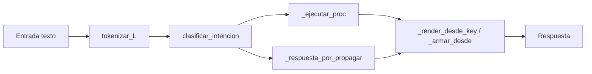

# Resumen ejecutivo

La visión del chat ([chat_con_gpt.md](chat_con_gpt.md)) pide evolucionar de **memoria asociativa textual** hacia un **núcleo cognitivo unificado**: semántica, episodios, procedimientos reestructurables y control (energía, atención, estabilidad), con jerarquía `carácter → palabra → gramática → intención → procedimiento`.

**Conclusión:** la base nativa (JMN/MAI + propagación) está avanzada (~85–90 % de infraestructura). Neurixis_IA hoy opera como **asociación + router procedural sembrado** (~25–35 % de la visión cognitiva “humana”). La comprensión léxica es **palabra + grafo semántico + contexto de turno**, no composición carácter a carácter ni algoritmos que se reescriben solos por experiencia.

---

# Parte 1 — Propuesta del chat vs realidad

## 1.1 Qué propone el documento (tres ejes)

| Eje | Idea central |
|-----|----------------|
| **Memoria unificada** | Texto, números y sensores → nodos y relaciones tipadas (no solo strings). |
| **Neuronas = algoritmos vivos** | Grafos con condiciones, pasos, evaluación y **reestructuración** (refuerzo, inhibición, meta-procedimientos). |
| **Jerarquía lingüística** | `símbolo → patrón → palabra → gramática → intención → procedimiento → abstracción`. |

Para casos como **“hola”** (letras `h-o-l-a`) y **“suma 3 por 6”** el chat exige **dos sistemas acoplados**:

1. **Semántico** — qué significa cada pieza.
2. **Procedural** — qué operación ejecutar (p. ej. `MULTIPLICAR(3,6)`), derivable o aprendido, no solo `3×6=18` memorizado.

Fórmula conceptual del chat:

```text
A_{n+1} = R(E(P(C(I))))
```

Donde: compresión conceptual (C), patrones (P), ejecución/simulación (E), reestructuración (R).

---

## 1.2 Estado por capa

### Infraestructura nativa (SDK) — sólida

| Capacidad | Estado | Referencia |
|-----------|--------|------------|
| Grafo tipado (τ 1–30) | Implementado | [TIPOS_RELACION_JMN.md](../../../docs/LENGUAJE/TIPOS_RELACION_JMN.md) |
| Propagación `d_max`, `K`, `g(τ)`, `mask`, `h(d)` | Implementado | [PROPAGACION_D_MAX_K_AUDITORIA_Y_ESTRES.md](../../../docs/LENGUAJE/jmn/PROPAGACION_D_MAX_K_AUDITORIA_Y_ESTRES.md) |
| Secuencias τ=3 | Implementado | `pensar_siguiente`, aristas tipo 3 |
| Rastro, journal `.jwl`, MAI | Implementado | [CAPAS_JMN_MAI_VM_Y_USO.md](../../../docs/LENGUAJE/CAPAS_JMN_MAI_VM_Y_USO.md) |
| Capa fonética / sílabas | **Plan futuro** | [JMN_PLAN_CAPA_FONETICA_FUTURO.md](../../../docs/LENGUAJE/JMN_PLAN_CAPA_FONETICA_FUTURO.md) |

Esto es el “sistema operativo cognitivo”; **no** es por sí solo aprendizaje de algoritmos al estilo humano.

### Neurixis_IA (app) — pipeline dominante



| Componente | Archivo | Qué hace hoy |
|------------|---------|--------------|
| Orquestación | `inicio.jasb` | Abre `memorias/neurixis_base.jmn`, carga semilla TXT |
| Generación | `cerebro/generador.jasb` | Router, procedimientos, propagación, render |
| Aprendizaje | `cerebro/aprendizaje.jasb` | Patrones de enseñanza, `_seq_guardar`, definiciones |
| Semilla | `memorias/semilla_conocimiento.txt` | ~1028 líneas `TIPO\|A\|B\|PESO` |
| Carga | `memorias/cargar_informacion_base.jasb` | Checksum + importación idempotente de semilla |

**Aprendizaje actual:** asociaciones tipadas + respuestas como **secuencias de tokens** (τ=3), no procedimientos que se reestructuran solos.

```jasboot
// aprendizaje.jasb — _seq_guardar (resumen)
// root → step:1 → step:2 → … con tokens en τ=2 (patrón)
asociar_relacion(prev, step, 3, 1.0)
asociar_relacion(step, tok, 2, 1.0)
```

**Procedimientos:** `_ejecutar_proc` recorre grafos `proc:*` en semilla; acciones son **tokens fijos** (`math_simple`, `propagar`, `emit_resp:…`), no nodos aprendidos dinámicamente.

**Matemática:** `_math_simple` en `generador.jasb` — parser ad hoc en Jasboot (busca `por`/`mas`/números). Cubre el ejemplo del chat **por código**, no por grafo procedural aprendido.

**Metacognición:** existe `_meta_eval` en `generador.jasb`, pero **`generar()` no lo invoca** antes de emitir. [11_metacognicion_y_simulacion.md](../../../flujo_model_IA/11_metacognicion_y_simulacion.md) sigue siendo mayormente diseño.

---

## 1.3 Comprensión de palabras: significado, uso, composición

| Dimensión | Implementación | ¿Como humano? |
|-----------|----------------|---------------|
| **Identidad** | `tokenizar_L` → nodo/concepto (`neurixis:tl:modo`, `min_len`) | Palabra como unidad; no morfema |
| **Significado** | Aristas τ=6, 7, 4, etc. + propagación desde semillas | Asociativo, no composicional |
| **Uso** | Triggers de intención, `neurixis:turno:*`, episodios MAI (τ=29) | Contexto conversacional sí; gramática emergente limitada |
| **Composición ortográfica** | **No** — no hay `h→o→l→a→hola` | El chat lo pide; el código salta a lexema `hola` |
| **Fonética** | Stub (`jmn_ultima_silaba` ≈ última palabra) | 0 % productivo |

La semilla y [semillavocabulario.jasb](../../../apps/neurixis/semillavocabulario.jasb) generan **palabras completas** (`hola`, verbos, sustantivos), coherente con [AGENTS.md](../../../AGENTS.md) (“tokens atómicos”, cuidado con τ=3), pero **opuesto** a la jerarquía carácter→palabra del chat.

**“Comprender” hoy** ≈ tokenizar → activar nodo → propagar → elegir candidato → renderizar cadena τ=3.

**No implica:** descomponer letras, morfología, procedimiento social aprendido más allá de grafos sembrados, ni `suma` activando `MULTIPLICAR` en JMN.

---

## 1.4 Aprendizaje de algoritmos “como humanos” — tabla de brecha

| Capacidad del chat | ¿Existe? | Evidencia |
|--------------------|----------|-----------|
| Procedimiento como grafo en memoria | **Parcial** | `proc:*` en semilla + `_ejecutar_proc` |
| Aprender procedimiento por diálogo | **Muy limitado** | `aprender_desde_ensenanza`, `aprender_definicion`; `aprender_secuencial` comentado |
| Sub-algoritmos que se refinan | **No** | Sin evaluación → reescritura de pasos |
| Meta-procedimiento (falla → reorganizar) | **No** | Solo en documentación |
| Abstracción secuencias → hábito | **No** | Fase 5 de [ruta_implementacion_algoritmos_reestructurables.md](ruta_implementacion_algoritmos_reestructurables.md) |
| Simulación antes de consolidar | **Plan** | [PLAN_APRENDIZAJE_DINAMICO.md](../../../apps/neurixis_IA/PLAN_APRENDIZAJE_DINAMICO.md) fases 4–6 |
| Energía/atención unificada por turno | **Parcial** | `neurixis:energia:E`, g/mask/d_max; no presupuesto global estricto |
| Multimodal en mismo núcleo | **Diseño** | Tipos JMN lo permiten; Neurixis no lo usa |

**Hoy en la práctica:**

```text
R' ≈ asociar(I) + propagar(I) + render(mejor_nodo)
```

sin **E** (simulación rica) ni **R** (reestructuración de procedimientos).

---

## 1.5 Mapa de madurez (estimación)

```text
Capa                          Propuesta chat    Implementado
─────────────────────────────────────────────────────────────
Grafo tipado + propagación    ████████████      ██████████░  (~90%)
Episodios / turno / MAI       ████████░░        ██████░░░░   (~60%)
Intención + enseñanza patrón  ███████░░░        █████░░░░░   (~50%)
Procedimientos en JMN         ██████████        ████░░░░░░   (~40% esqueleto)
Aprendizaje procedural vivo   ██████████        █░░░░░░░░░   (~10%)
Jerarquía carácter→palabra    ██████████        ░░░░░░░░░░   (~0%)
Gramática emergente           ████████░░        ██░░░░░░░░   (~20%)
Meta-aprendizaje / simulación ██████████        █░░░░░░░░░   (~10% docs+código muerto)
Multimodal unificado          ████████░░        ░░░░░░░░░░   (~0% en IA)
```

---

## 1.6 Lectura estratégica y orden recomendado

**Fortaleza actual:** motor asociativo persistente, tipado, auditable y acotable en CPU — base correcta para la visión.

**Para acercarse a “algoritmos como humanos”** (alineado con la ruta del repo):

1. Esquema de nodos (`proc:`, `step:`, `slot:`, proveniencia) en semilla — sin hardcode de negocio en app.
2. Procedimientos mínimos **editables por aprendizaje**, no solo `emit_resp:` fijos.
3. Evaluación + reestructuración (éxito/fallo del turno → refuerzo/inhibición de pasos).
4. Capa léxica opcional (caracteres/fonética v0) solo si el producto lo exige.
5. Metacognición operativa: conectar `_meta_eval` al pipeline de emisión + sandbox efímero.

---

# Parte 2 — Inventario operativo (semilla, memoria, código, bugs)

## 2.1 Archivos de memoria y rutas

| Archivo | Uso | Notas |
|---------|-----|-------|
| `apps/neurixis_IA/memorias/neurixis_base.jmn` | **Producción local** por defecto (`inicio.jasb`) | Se muta en conversación |
| `apps/neurixis_IA/memorias/semilla_conocimiento.txt` | Verdad de configuración (importada si cambia checksum) | 856 líneas |
| `apps/neurixis_IA/memorias/test_aprender_def.jmn` | Test `test_aprendizaje_definicion.jasb` | Memoria limpia por test |
| `apps/neurixis_IA/memorias/test_smoke_conversacion.jmn` | Smoke conversacional | |
| `build/memoria_integral.jmn` | Artefacto de **test integral** compilado | Referenciado en `build/test_neurixis_integral.jbo`; saludo/despedida precargados; **no** es la memoria de `inicio.jasb` |
| `build/neurixis.jbo` / `build/neurixis_IA.jbo` | Binarios compilados | En git status como untracked |

**CLI memoria** (`inicio.jasb`): `--mem=`, `--sandbox` → `build/neurixis_sandbox.jmn`, `--prod` → `build/neurixis_prod.jmn`, `--reset-mem` borra `.jmn` y `.jwl`.

---

## 2.2 Procedimientos `proc:*` en semilla (Fase 2 de la ruta)

Definidos en `semilla_conocimiento.txt` líneas 40–64:

| Intención (`neurixis:router:intent:*`) | Procedimiento | Pasos (τ=3) | Acciones (τ=2) |
|----------------------------------------|---------------|-------------|----------------|
| `saludo` | `proc:saludo` | `proc:saludo:1` | `emit_resp:saludo` |
| `pregunta` | `proc:pregunta` | `:1` → `:2` | `definicion_directa` → `propagar` |
| `ayuda` | `proc:ayuda` | `:1` | `emit_resp:ayuda` |
| `math` | `proc:matematica_simple` | `:1` → `:2` | `math_simple` → `propagar` |
| `feedback`, `defecto` | `proc:chat` | `:1` | `propagar` |

**Prefijos de esquema** (Fase 1 parcial): `ent:`, `evt:`, `proc:`, `step:`, `slot:` en semilla — convención documentada, uso limitado a `proc:` y pasos numerados.

**Limitación:** estos grafos son **estáticos en TXT**; no hay API de “promover secuencia repetida a nuevo `proc:`” ni meta-procedimiento que los modifique.

---

## 2.3 Otros bloques relevantes en semilla

| Clave / prefijo | τ típico | Rol |
|-----------------|----------|-----|
| `neurixis:resp:roots` | 1 | Raíces renderizables (`saludo`, `neutral`, `defecto`, …) |
| `neurixis:g:override`, `neurixis:ctx:chat_sin_geo` | 1, 26 | Perfil de propagación |
| `neurixis:meta:*` | 1, 26 | Pesos de metacognición (**configurados, no usados en `generar()`**) |
| `neurixis:learn:tau_resp` | 26 → **24** | Respuestas aprendidas |
| `neurixis:ensenanza:pats` + `neurixis:pat:*` | 3, 2 | Patrones “X es Y”, “causa”, “parte de”, etc. |
| `neurixis:intent:*:tok` | 1 | Triggers de intención |
| `neurixis:intent:matcher:*` + `neurixis:intent:pat:*` | 1, 2, 3 | Patrones de clasificación (estado, definición, cortesía, confusión) → intent |
| `neurixis:seed:peso:policy` | 1, 26 | Plantillas de peso inicial (cat/struct/tok/out) para refuerzo |
| `neurixis:tl:stop` | 1 | Stopwords tokenización (**incluye `es`, `y`, `por`**) |
| `tpl:*` | 3, 2 | Plantillas de respuesta (clarify, learn, math div0, …) |
| Secuencias `saludo:`, `neutral:`, `despedida:` | 3, 2 | Frases compuestas para render |

**Respuestas base:** nodos `saludo`, `neutral`, `defecto`, etc. con cadenas τ=3 (p. ej. “Hola! Soy Neurixis…” en `build/memoria_integral.jmn`).

---

## 2.4 Módulos de aplicación (`apps/neurixis_IA/cerebro/`)

| Módulo | Estado respecto a la visión |
|--------|----------------------------|
| `generador.jasb` | **Núcleo activo** — proc, propagar, render, math, episodios |
| `aprendizaje.jasb` | Enseñanza por patrones; muchas funciones **comentadas** (secuencial, refuerzo avanzado) |
| `entrada.jasb`, `salidas.jasb` | I/O |
| `normalizador.jasb`, `razonador.jasb`, `pensamiento.jasb`, `bucle_mental.jasb` | Soporte / experimentación — revisar acoplamiento con `generar()` |
| `memoria.jasb`, `almacenamiento/` | Persistencia auxiliar |

---

## 2.5 Alineación con fases de [ruta_implementacion_algoritmos_reestructurables.md](ruta_implementacion_algoritmos_reestructurables.md)

| Fase | Objetivo | Estado en repo |
|------|----------|----------------|
| **0** | Respuesta válida, sin loops | **Hecho** — filtros render/candidatos; test memoria `FALLIOS=0` |
| **1** | Esquema + proveniencia | **Hecho (v2)** — routing por `neurixis:intent:matcher:*` (sin frases hardcodeadas); pesos semilla &lt; 1.0 |
| **2** | Procedimientos mínimos | **Hecho en semilla** — 5 `proc:*`; ejecución en `_ejecutar_proc` |
| **3** | Episódico + recencia + confianza | **Parcial (v1)** — `_confianza_concepto`, máscara τ=29=0 en chat, ranking `bonus_learn`, episodio sin semillar `E_*` |
| **4** | Energía + atención | **Parcial (gate meta)** — `_meta_aprobar_respuesta` antes de emitir; máscara τ=29 pendiente en propagación |
| **5** | Abstracción / hábitos | No |
| **6** | Simulación procedural | No (solo `_meta_eval` sin bucle de emisión) |

[PLAN_APRENDIZAJE_DINAMICO.md](../../../apps/neurixis_IA/PLAN_APRENDIZAJE_DINAMICO.md): fases 0–2 en progreso; 3–8 pendientes (sandbox, metacognición aprendizaje, olvido).

---

## 2.6 Bug `debug-neurixis-ia-not-working.md` — causas y fase que lo corrige

### Síntomas

- Test definición: respuesta a veces `"es"` / `"y"`.
- Chat: aparece `E_<timestamp>_<n>` como respuesta.

### Mecanismo raíz (código)

**IDs episódicos** — `generador.jasb` `_registrar_episodio`:

```text
eid = "E_" + timestamp + "_" + contador
```

Se enlazan tokens de entrada/salida con MAI (τ=29). Si la propagación rankea `eid` o un token suelto, `_render_desde_key` puede devolver la clave cruda o un token stopword.

**Stopwords en ranking** — `semilla_conocimiento.txt` marca `es`, `y`, `por`, etc. como `neurixis:tl:stop`, pero:

- Siguen existiendo como nodos en el grafo.
- `_respuesta_directa_si_existe` / propagación pueden seleccionarlos si τ=24/9/1 apunta mal o hay ambigüedad de IDs.

**τ=24 vs secuencias** — Aprendizaje guarda `neurixis:learn:resp:*` con τ=24 (config) + τ=9/τ=1; el render espera secuencia τ=3 bajo la key. Mezcla de formatos → fragmentos (`"es"`) o keys no humanas.

### Hipótesis ↔ fase de la ruta

| Hipótesis (debug doc) | Fix alineado | Fase ruta |
|----------------------|--------------|-----------|
| A) `_render_desde_key` devuelve keys crudas (`E_…`) | Filtrar `E_*`, `neurixis:*` no-respuesta; nunca emitir key sin secuencia | **0** |
| B) Ambigüedad IDs, elige `"es"`/`"y"` | Priorizar nodos con `neurixis:learn:resp:` / roots; excluir stop set en candidatos | **0 + 1** |
| C) Ranking incluye episodios | Máscara de candidatos post-propagación; inhibir τ=29 en salida | **4** |
| D) UTF-8 / normalización | Revisar `tokenizar_L` y `_normalizar_concepto` | **0** |
| E) τ=24 vs τ=9/1 inconsistente | Unificar contrato: siempre `_seq_guardar` + un τ de lectura | **1** |

### Reproducción documentada

```bash
node .vscode/run-jasb.cjs apps/neurixis_IA/tests/memoria/test_aprendizaje_definicion.jasb
node .vscode/run-jasb.cjs apps/neurixis_IA/inicio.jasb
```

### Estado Fase 0 (2026-05-22)

Implementado en `generador.jasb` / `aprendizaje.jasb`. `test_aprendizaje_definicion.jasb` → `FALLIOS=0`.

Causas cerradas: `_respuesta_es_debil` en frases multi-palabra; gate `clarify` opcional; enseñanza `X es Y` → `aprender_definicion` + `neurixis_learn_resp_*_def`.

### Estado Fase 1 + conversación social (2026-05-22)

**Semilla** (`semilla_conocimiento.txt`):

- `neurixis:clarify:que/es/como/porque:tok` (ya operativos con `_tok_set`).
- Respuestas `estado`, `cortesia`; plantillas `tpl:feedback:ack`, `tpl:confusion:ack`.
- `neurixis:intent:estado:tok`; feedback sin `no`/`mal` sueltos (evita falsos positivos).

**Generador:**

- `_consulta_es_estado_animo`, `_consulta_es_cortesia_bien`, `_consulta_es_confusion`.
- `_es_pregunta_informativa` (no trata «cómo estás» como pregunta de definición).
- Feedback corto sin eco de `prev_in`; eliminado bucle «entiendo → aclaratoria».

**Meta (Fase 4 v1):** `_meta_aprobar_respuesta` + `neurixis:meta:theta_bp` (35 → umbral 0.35) antes de guardar turno.

**Tests:** `tests/smoke/test_conversacion_social.jasb` (Hola, cómo estás, cortesía, confusión).

> Tras actualizar semilla: borrar `memorias/neurixis_base.jmn` + `.jwl` o ejecutar `inicio.jasb --reset-mem` para recargar checksum.

### Estado Fase 1 v2 — routing 100 % JMN (2026-05-22)

**Objetivo:** clasificación y consultas sociales sin cadenas fijas en código (`" que es "`, `como`+`estas`, frases de confusión). Todo aprendible desde memoria.

**Semilla:**

- Hubs `neurixis:intent:matcher:{estado,def,cortesia,confusion,feedback}` con patrones `neurixis:intent:pat:*` (τ=3 secuencia + τ=2 tokens + τ=1 → intent).
- Umbrales τ=26: `neurixis:intent:feedback:min_hits`, `neurixis:intent:estado:min_tok`.
- **Política de pesos** `neurixis:seed:peso:policy` — aristas sembradas **por debajo de 1.0** para dejar margen de refuerzo al consolidar:

| Clave τ=26 | Valor | Uso en semilla |
|------------|-------|----------------|
| `neurixis:seed:peso:intent:cat` | 0.847321 | matcher → raíz de patrón |
| `neurixis:seed:peso:intent:struct` | 0.913554 | eslabones τ=3 del patrón |
| `neurixis:seed:peso:intent:tok:alta` | 0.891237 | tokens discriminativos (`estas`, `entiendo`, `significa`, …) |
| `neurixis:seed:peso:intent:tok:media` | 0.873651 | tokens frecuentes (`como`, `que`, `bien`, `no`, …) |
| `neurixis:seed:peso:intent:tok:baja` | 0.856204 | tokens ambiguos (`es`, `tu`, `tal`, `me`, …) |
| `neurixis:seed:peso:intent:out` | 0.902418 | patrón → intent (`saludo`, `pregunta`, `feedback`) |

El runtime de **matching** (`_match_seq` en `aprendizaje.jasb`) no ordena por peso; los pesos importan en **propagación** y en **`asociar_relacion(..., w)`** al aprender (p. ej. sinónimos +0.35, definiciones +0.95). Sembrar en 1.0 saturaba el techo y dificultaba distinguir rutas tras refuerzo.

**Aprendizaje** (`aprendizaje.jasb`):

- `_mejor_patron_catalogo`, `coincide_catalogo_tokens`, `consulta_es_estado`, `consulta_es_confusion`, `es_pregunta_informativa`.
- `clasificar_intencion` usa solo catálogos JMN + scores de `neurixis:intent:*:tok`.
- Fallback de definición tras patrón: copulas desde `neurixis:intent:ensenanza:tok`, no `contiene_texto(..., " es ")`.

**Generador:** delega detección social a `Aprendizaje` (sin duplicar lógica de idioma).

**Aprendizaje conversacional (2026-05-22):**

- `neurixis:intent:aprende:tok` + `neurixis:intent:matcher:ensenanza` (aprende+esto, puedes+aprender, recuerda+que).
- Patrones `neurixis:pat:18|19|20` en `neurixis:ensenanza:pats` (τ=18/19/20); extracción tema/cuerpo tras «aprende esto».
- `consulta_es_ensenanza` prioritaria en `clasificar_intencion` y en `generar()` (antes de cortesía/saludo).
- Plantillas `tpl:learn:*`; test `tests/smoke/test_aprendizaje_dialogo.jasb`.

### Próximos pasos de ingeniería (prioridad)

1. ~~**Fase 0**~~ / ~~**Fase 1 (v2 routing JMN)**~~ / ~~**gate meta v1**~~ — hechos.
2. ~~**Fase 3 (v1):** confianza episódica + inhibir τ=29 en propagación de chat + ranking por evidencia aprendida.~~
3. **Fase 5–6:** abstracción de hábitos y simulación procedural (`_meta_eval` en bucle de candidatos).
4. **Fase 2+:** ampliar `proc:*` solo con tests de regresión conversacional.

### Estado Fase 3 v1 — confianza episódica (2026-05-22)

**Semilla** (`semilla_conocimiento.txt`):

- `neurixis:episodio:k_recientes`, `w_recencia`, `w_conf`; `neurixis:learn:conf_min`, `conf_boost`; `neurixis:phi:bonus_learn`, `alpha:override` τ=24/6/9.
- Máscara chat: `tau:29|0.0` (episodios no propagan ruido); `tau:24|1.0` (respuestas aprendidas sí).

**Generador** (`generador.jasb`):

- `_confianza_concepto`, `_score_asoc_respuesta`: elige definición aprendida por peso + recencia episódica, no por orden de lista.
- `_relevancias_alpha_phi`: bonus `bonus_learn` proporcional a confianza del concepto consultado.
- `_agregar_semillas_episodicas`: semillas = tokens de turnos recientes (no IDs `E_*`).
- `_registrar_episodio(..., intent)`: proveniencia de intención en MAI τ=27.

**Aprendizaje** (`aprendizaje.jasb`): `reforzar(conc, tau_resp)` tras `aprender_definicion`.

**Tests:** `tests/memoria/test_episodio_confianza.jasb` (confianza ≥ umbral, recall sin `E_*`).

> Tras actualizar semilla: borrar `memorias/neurixis_base.jmn` + `.jwl` o `inicio.jasb --reset-mem`.

---

## 2.7 Tests y artefactos build

| Test / artefacto | Qué valida |
|------------------|------------|
| `tests/memoria/test_aprendizaje_definicion.jasb` | `aprender_definicion` + `_render_desde_key` + `_respuesta_directa_si_existe` |
| `tests/smoke/test_conversacion_social.jasb` | Saludo, estado anímico, cortesía, confusión (sin eco) |
| `tests/smoke/test_smoke_conversacion.jasb` | Conversación mínima |
| `build/test_neurixis_integral.jbo` | Integración con `build/memoria_integral.jmn` |
| `inicio.jasb --diag` | Diagnóstico roots, propagar(hola), `_leer_resp` |

---

# Referencias cruzadas

- Conversación origen: [chat_con_gpt.md](chat_con_gpt.md)
- Ruta de ingeniería: [ruta_implementacion_algoritmos_reestructurables.md](ruta_implementacion_algoritmos_reestructurables.md)
- Explicación no técnica neuronas-algoritmo: [algoritmos_como_neuronas_explicacion.md](algoritmos_como_neuronas_explicacion.md)
- Plan aprendizaje en app: [PLAN_APRENDIZAJE_DINAMICO.md](../../../apps/neurixis_IA/PLAN_APRENDIZAJE_DINAMICO.md)
- Seguimiento bug: [debug-neurixis-ia-not-working.md](../../../debug-neurixis-ia-not-working.md)
- Metacognición (diseño): [11_metacognicion_y_simulacion.md](../../../flujo_model_IA/11_metacognicion_y_simulacion.md)

---

*Documento generado para dejar constancia del análisis del 2026-05-22. Actualizar cuando cambien semilla, `generador.jasb` o se cierre el bug de respuestas.*
