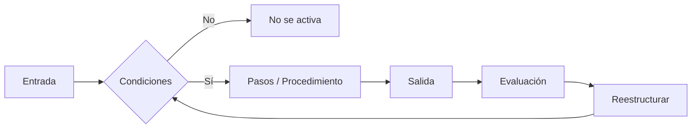
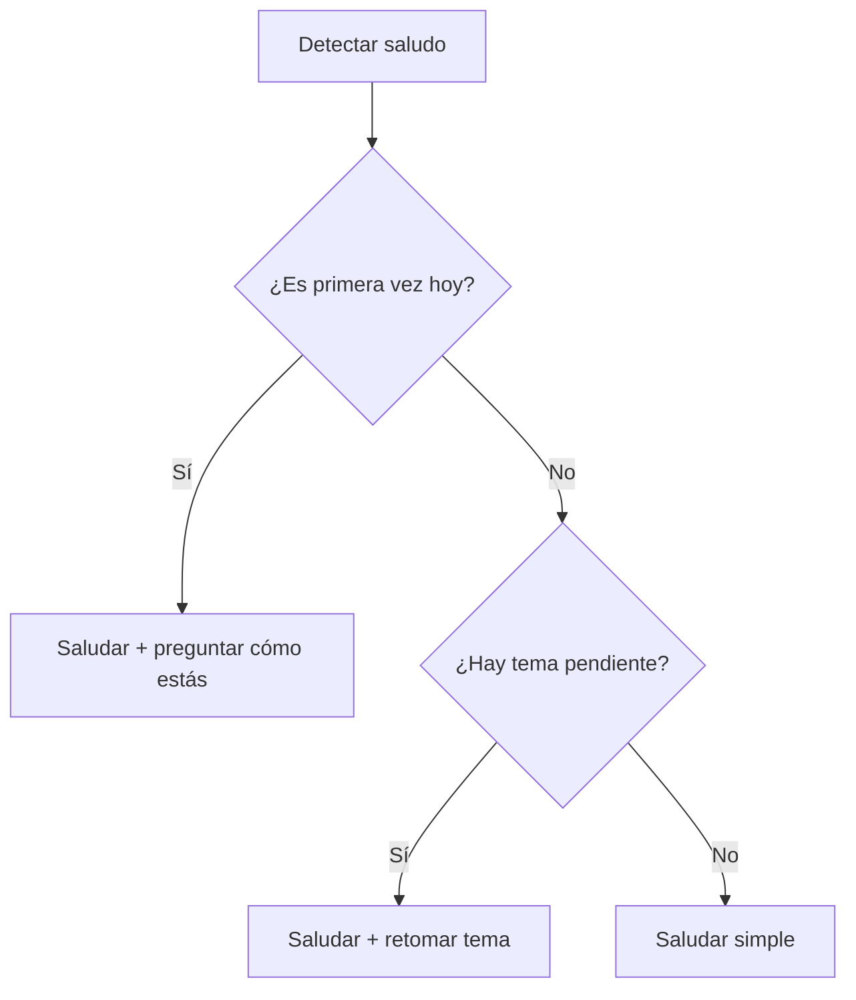
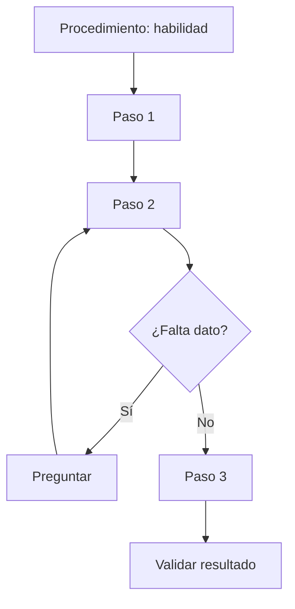
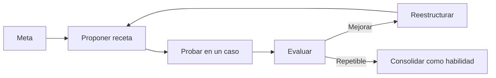
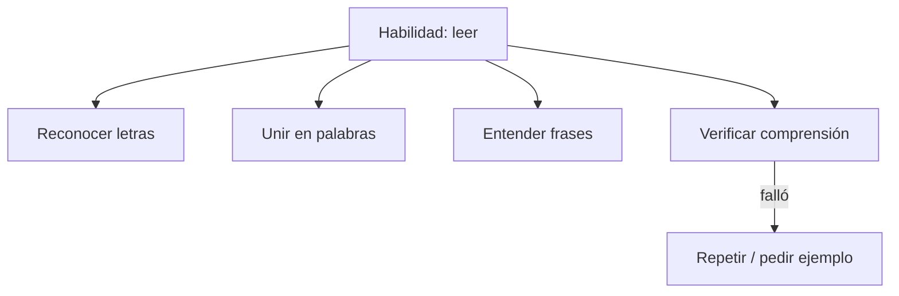
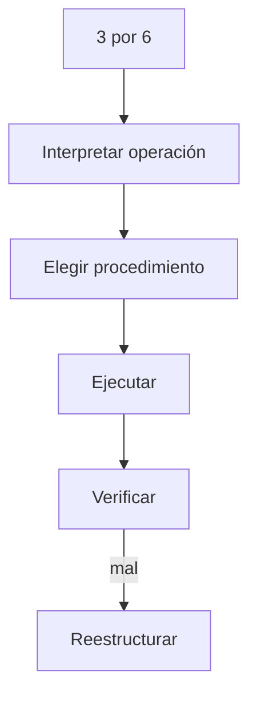
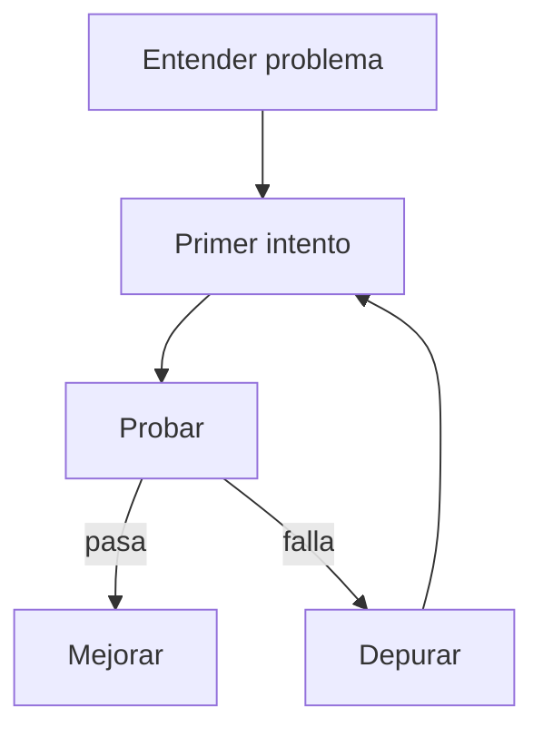

# Idea central (explicada simple)

Cuando dices “en vez de conexiones, que sean algoritmos”, estás proponiendo que la unidad base del sistema no sea solo:

- “A se conecta con B”

sino:

- “A es una pequeña máquina que sabe hacer algo”.

En un cerebro humano, la “inteligencia” no vive en una sola neurona. Vive en **patrones de activación** y en cómo el cerebro **cambia** sus caminos con experiencia. Tu idea intenta capturar eso: que cada unidad (lo que hoy llamamos “neurona” en JMN) sea un **micro‑proceso** que:

- recibe señales,
- decide qué hacer,
- produce una salida,
- y se modifica con el tiempo.

# Mi opinión (con criterio de ingeniería)

## Lo bueno

- Es una idea potente para lograr **comportamiento** y no solo “memoria”.
- Te obliga a modelar “cómo” se llega a una respuesta (procedimiento), no solo “qué” se recuerda.
- Se alinea con aprendizaje incremental: mejorar rutas y hábitos sin re-entrenar un modelo gigante.

## El riesgo principal

Si reemplazas por completo “conexiones” por “algoritmos”, puedes perder lo mejor de un grafo: su capacidad de **enlazar** y **recuperar** información de forma simple y eficiente.

En la práctica, lo más sano es:

- mantener **conexiones** (porque son un mapa rápido del conocimiento),
- y agregar **algoritmos** como “unidades activas” que usan esas conexiones.

En otras palabras:

> Las conexiones son los caminos.  
> Los algoritmos son los “hábitos” o “músculos” que recorren esos caminos.

# Entonces… ¿cómo sería una “neurona‑algoritmo”?

Una neurona‑algoritmo es como una receta que se puede mejorar.

## Componentes (en lenguaje cotidiano)

- **Entrada:** lo que le llega (texto, evento, intención).
- **Condiciones:** cuándo se activa (“si detecto una pregunta…”).
- **Pasos:** qué hace (buscar memoria, comparar, preguntar algo).
- **Salida:** qué responde o qué acción dispara.
- **Memoria interna:** lo que aprendió (qué funcionó y qué no).
- **Energía:** cuánto “costo” le queda para pensar en este turno.

## Diagrama simple

# “Reestructurable” vs “autoreestructurable”

## Reestructurable

Significa: “puedo cambiar mis pasos con experiencia”.

Ejemplo humano:

- La primera vez haces algo lento y con muchos pasos.
- Con práctica, haces un atajo.

## Autoreestructurable

Significa: “yo mismo detecto que estoy fallando y me reorganizo”.

Ejemplo humano:

- Te das cuenta de que tu forma de estudiar no funciona.
- Cambias la estrategia (más ejercicios, menos teoría).

En IA: eso es meta‑aprendizaje básico.

# Cómo se reestructura sin volverse loco (punto crítico)

Para que el sistema no se rompa, necesitas tres frenos:

1. **Límite de exploración:** no probar infinitas variantes en un turno.
2. **Inhibición anti-loop:** si estoy repitiendo lo mismo, paro.
3. **Consolidación:** no guardar todo; solo lo que se valida.

Esto no es opcional: es lo que evita “caos cognitivo”.

# Fórmulas (simples y entendibles)

Estas fórmulas no son “matemática avanzada”; son reglas para que el sistema se comporte bien.

## 1) Prioridad de activación (Atención)

Una unidad decide “¿me activo o no?” según un puntaje:

**Activación**
\[
A = (P \cdot R \cdot E) - N
\]

Donde:

- \(P\) = prioridad (qué tan importante es esta unidad)
- \(R\) = relevancia con lo que el usuario dijo
- \(E\) = energía disponible (si hay poca energía, se usa lo más directo)
- \(N\) = ruido (cosas poco útiles o repetidas)

Si \(A\) es alto, se activa. Si es bajo, se ignora.

## 2) Aprendizaje por refuerzo suave (subir/bajar confianza)

Cada vez que una neurona‑algoritmo produce una salida, se evalúa:

\[
W*{nuevo} = clamp(W*{viejo} + \alpha \cdot (S - \beta), 0, 1)
\]

Donde:

- \(W\) = “fuerza” o confianza en ese paso/ruta
- \(S\) = éxito observado (0 a 1)
- \(\alpha\) = velocidad de aprendizaje (pequeña)
- \(\beta\) = umbral mínimo (para no reforzar basura)

## 3) Olvido (para que no crezca sin control)

Si algo no se usa por mucho tiempo, baja solo:

\[
W(t) = W_0 \cdot e^{-\lambda t}
\]

- \(\lambda\) controla qué tan rápido olvida.
- Esto evita memoria infinita y mantiene lo útil “vivo”.

# ¿Dónde viven las “conexiones” en este modelo?

Hay 3 formas razonables de implementar tu idea, de menos a más radical:

## Opción A (recomendada): conexiones normales + nodos procedurales

- Conexiones siguen siendo relaciones (A → B con tipo y peso).
- Los “algoritmos” viven en ciertos nodos especiales: `proc:*`.

Ventaja: estable, fácil de depurar, aprovecha JMN tal como está.

## Opción B: conexiones que disparan comportamiento

- Las conexiones no solo apuntan a otro concepto.
- Apuntan a un “paso”: una acción (preguntar, buscar, comparar).

Ventaja: procedimientos muy compactos.
Riesgo: más difícil de entender/depurar.

## Opción C (más radical): todo son algoritmos

- No hay “relaciones pasivas”.
- Todo es un proceso que decide a dónde ir.

Ventaja: muy flexible.
Riesgo: se vuelve inestable rápido si no hay control fuerte.

# Ejemplo real (no técnico): “saludo” que evoluciona

## Primera vez

Usuario: “Hola”  
Sistema: responde un saludo fijo.

## Después de 20 conversaciones

El sistema aprende que:

- si es la primera interacción del día, pregunta cómo te fue,
- si ayer dejaste un tema pendiente, lo retoma.

En vez de memorizar respuestas, crea un procedimiento:

# Cómo se conecta con lo que ya tenemos en Jasboot/JMN

Hoy JMN ya tiene:

- nodos, tipos de relación, pesos,
- secuencias (tipo 3),
- propagación con `d_max` y `K`,
- y MAI como “memoria activa”/contexto reciente.

Eso significa que el salto hacia procedimientos reestructurables no es “reinventar todo”, sino:

- definir un esquema para “procedimientos” (nodos + secuencias + condiciones),
- ejecutar esos pasos desde la app,
- y solo llevar a nativo lo que sea transversal y de performance.

# Recomendación final (clara)

Si quieres “algoritmos como neuronas” sin romper estabilidad:

- No elimines las conexiones: úsalas como “mapa”.
- Añade neuronas‑algoritmo como **procedimientos** que recorren el mapa.
- Implementa primero el control (energía, inhibición, olvido, consolidación).

Eso te da lo mejor de los dos mundos:

- memoria asociativa rápida,
- y comportamiento procedural que mejora con experiencia.

# Lo que faltaba: ¿cómo crea algoritmos por sí sola sin tocar código?

Para que una IA “cree algoritmos” sola, hay una verdad importante (dicha simple):

> No puede inventar una computadora nueva dentro de sí.  
> Pero sí puede **combinar** y **reorganizar** piezas pequeñas que ya tiene, hasta formar habilidades complejas.

Igual que un humano:

- no “cambia la física” para aprender a leer,
- pero aprende combinando piezas: atención, memoria, repetición, corrección, y práctica.

En software esto se logra con una separación clara:

1. El código trae una **caja de herramientas mínima** (pocas piezas bien hechas).
2. La memoria (JMN) guarda y modifica **combinaciones** de esas piezas (procedimientos).
3. Un ciclo de prueba/evaluación decide cuáles combinaciones se vuelven “habilidad”.

## 1) La caja de herramientas mínima (lo único que sí va en código)

Aunque “no quieras tocar código para cada habilidad”, siempre necesitas un conjunto de piezas base.
Piénsalo como los “opcodes” de una CPU: con pocas instrucciones puedes construir programas infinitos.

Ejemplos de piezas base (explicadas fácil):

- **observar:** guardar lo que pasó (input/output/resultado).
- **buscar:** traer recuerdos relacionados.
- **comparar:** ver si dos cosas son iguales o parecidas.
- **dividir:** separar un problema en partes.
- **repetir:** practicar un paso muchas veces.
- **preguntar:** pedir el dato faltante.
- **validar:** comprobar si algo funcionó (con reglas simples o pruebas).
- **guardar como procedimiento:** convertir una secuencia exitosa en “rutina”.

Con esas piezas, la IA no necesita que tú le “inyectes” cada habilidad en código.
Lo que haces es darle **entrenamiento** (libros, ejercicios, retroalimentación) y ella arma procedimientos en memoria.

## 2) Qué es un “procedimiento” en memoria (la habilidad)

Una habilidad no es una respuesta. Es una receta que puede elegir pasos según el caso.

Un procedimiento en memoria suele verse así:

- un **inicio**,
- varios **pasos**,
- **condiciones** (“si falta X, entonces pregunta”),
- y una **evaluación** final (“¿se logró?”).

## 3) El “motor creador de algoritmos” (en lenguaje humano)

Esto es lo que hace que la IA cree nuevos algoritmos sola:

1. **Detecta una meta**: “quiero aprender X” o “no sé responder esto”.
2. **Propone un intento**: arma una receta con piezas base.
3. **Lo prueba**: en un ejemplo real (ejercicio, conversación, problema).
4. **Evalúa**: mide si funcionó.
5. **Reestructura**: cambia pasos/orden/condiciones.
6. **Consolida**: si funciona repetidas veces, lo guarda como habilidad estable.

### ¿Qué significa “reestructurar” exactamente?

No es magia. Es aplicar “operadores de cambio” sobre la receta, por ejemplo:

- agregar un paso,
- eliminar un paso que sobra,
- cambiar el orden,
- cambiar una condición (“si pasa A entonces…”),
- cambiar parámetros (más búsqueda, menos búsqueda),
- dividir una receta grande en 2 sub‑recetas,
- crear un atajo (“si ya vi este caso, ir directo al paso 4”).

## 4) La parte más importante: evaluación (sin evaluación no hay habilidad)

Una IA no puede “aprender una habilidad profesional” solo leyendo, si no puede comprobar si lo que entendió está bien.

Un humano aprende profesionalmente porque tiene:

- ejercicios,
- correcciones,
- resultados observables,
- consecuencias reales.

En IA es igual: necesitas una forma de medir éxito.

### Fórmula simple de “calidad” del procedimiento

\[
U = w_c \cdot C + w_r \cdot R - w_k \cdot K - w_t \cdot T
\]

Donde:

- \(C\) = corrección (¿estuvo bien?)
- \(R\) = reutilización (¿sirve para muchos casos?)
- \(K\) = costo (¿cuánta energía/tiempo gastó?)
- \(T\) = riesgo/ruido (¿provoca loops o respuestas basura?)
- \(w\_\*\) = pesos (importancia de cada factor)

La IA “crea algoritmos” porque busca maximizar \(U\): recetas más correctas, más generales y más baratas.

## 5) ¿Cómo aprende reglas de una habilidad sin que tú programes esas reglas?

Aprende reglas como aprendemos nosotros: por **regularidades**.

Ejemplo: si ve muchas veces:

- “si falta un dato, primero preguntarlo”

la IA puede generalizar la regla:

> Regla: “si hay un hueco crítico de información, preguntar antes de concluir”.

Y esa regla se convierte en parte de sus procedimientos.

## 6) Ejemplos concretos de habilidades complejas (cómo se formarían)

### A) Aprender a leer

Para “leer” necesitas sub‑habilidades:

- reconocer símbolos,
- formar palabras,
- entender frases,
- y verificar comprensión.

La IA podría construirlo como una jerarquía:

La evaluación aquí no es “sentirse inteligente”; es:

- ¿reconoció bien?
- ¿respondió preguntas de comprensión bien?
- ¿mejoró con práctica?

### B) Aprender matemáticas

Matemáticas no es “memorizar respuestas”; es:

- detectar operación,
- convertir texto a estructura,
- ejecutar un procedimiento,
- verificar.

Ejemplo para multiplicación:

Validación:

- ejercicios con respuesta conocida,
- o propiedades (ej. “si a\*b = c entonces c/b = a” cuando aplica).

### C) Aprender a programar

Programar exige evaluación externa, porque “suena bien” no basta:

- compila / no compila,
- pasan tests / fallan tests,
- corre rápido / corre lento.

El procedimiento “programar” se forma con hábitos:

- leer el problema,
- diseñar,
- escribir un intento,
- ejecutar pruebas,
- depurar,
- refactorizar.

Validación:

- tests automáticos,
- ejemplos de entrada/salida,
- revisión de estilo (más adelante).

# Lo que permite que escale “sin importar la complejidad”

La complejidad se vuelve manejable cuando la IA puede:

1. **Dividir**: convertir una habilidad grande en sub‑habilidades.
2. **Reusar**: usar lo aprendido en otros contextos.
3. **Generalizar**: no memorizar casos; extraer patrones.
4. **Consolidar**: guardar lo que funciona como rutina estable.

En resumen:

> La IA no aprende “cualquier cosa” por arte de magia.  
> Aprende “cualquier cosa” cuando tiene piezas base + evaluación + capacidad de reescribir procedimientos en memoria.

# Nota honesta (importante)

Si el objetivo es que la IA aprenda habilidades “profesionales” de verdad, necesitas además:

- un “mundo” donde practicar (problemas, ejercicios, tests, simulación),
- y un mecanismo de corrección (feedback).

Sin práctica y feedback, la IA puede almacenar mucha información, pero no desarrollará habilidades confiables.
