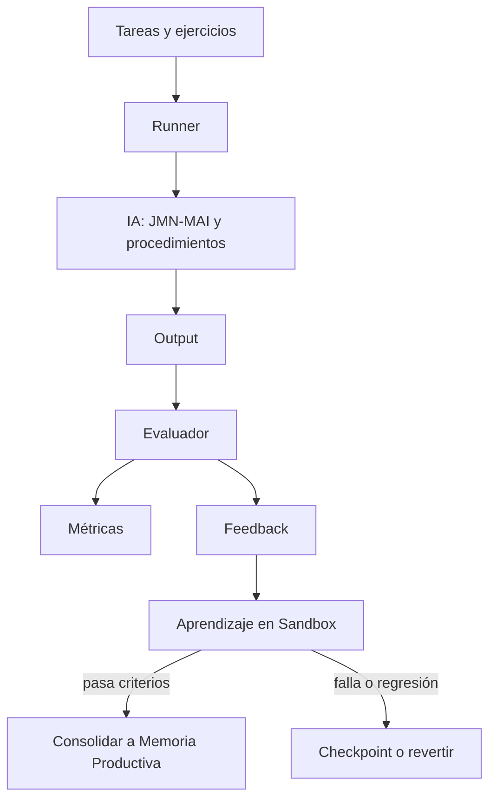

# 1) Objetivo

Si quieres que la IA aprenda “habilidades profesionales” sin tocar el código para inyectar cada habilidad, el entorno de pruebas debe permitir:

- práctica repetible (muchos intentos),
- corrección objetiva (saber si estuvo bien o mal),
- medición (progreso real),
- y seguridad (evitar que el aprendizaje destruya la estabilidad del sistema).

Piensa en esto como un “gimnasio” donde la IA entrena habilidades.

# 2) Principio clave: sin feedback no hay habilidad

Leer información sirve para **conocimiento** (“qué es X”).
Para **habilidad** (“cómo hacer X bien”) necesitas:

- ejercicios,
- validación,
- y repetición.

En la práctica, eso se logra con “tareas” y “evaluadores”.

# 3) Diseño recomendado (capas)

## 3.1 Dataset de tareas (la práctica)
Conjunto de ejercicios por habilidad, de dificultad gradual:

- lectura: comprensión, inferencia simple, corrección ortográfica, segmentación.
- matemáticas: operaciones, álgebra básica, problemas de texto, verificación por propiedades.
- programación: problemas con tests, entradas/salidas, casos borde.
- conversación: coherencia, seguimiento de contexto, preguntas correctas cuando falta info.

Cada tarea debe tener:
- **entrada**
- **criterio de éxito**
- **puntuación**
- **trazas** (qué intentó hacer la IA)

## 3.2 Runner (el entrenador)
Un ejecutor que:
- alimenta tareas a la IA,
- captura la salida,
- ejecuta evaluación,
- y registra métricas.

Requisito: que sea determinista cuando se necesite (misma semilla → mismo resultado) para poder comparar mejoras.

## 3.3 Evaluadores (el feedback)
Los evaluadores deben ser lo más objetivos posible:

- **Exact match**: respuesta exacta esperada (útil en matemáticas).
- **Propiedades**: validación por reglas (ej. conmutatividad, inversa, consistencia).
- **Tests**: para programación (pasa/falla).
- **Rubrica**: para conversación (reglas simples: no repetir, no alucinar, pedir aclaración si falta dato).

Mientras más objetiva sea la evaluación, más “profesional” puede volverse la habilidad.

## 3.4 Motor de currículo (subir dificultad)
La IA no debe entrenar siempre lo mismo. Debe:

- iniciar en lo básico,
- subir dificultad solo cuando el porcentaje de éxito sea estable,
- volver a niveles anteriores si hay regresión.

# 4) Métricas mínimas (para saber si mejora)

Recomiendo medir por habilidad y global:

- **Accuracy** (porcentaje correcto).
- **Consistencia** (si repite resultados correctos en tareas parecidas).
- **Costo** (tiempo/energía por tarea; menor es mejor si la precisión no baja).
- **Estabilidad** (loops = 0, no respuestas basura, crecimiento de memoria controlado).
- **Retención** (si lo aprendido se mantiene luego de N días o N sesiones).

# 5) Seguridad y estabilidad (no negociable)

Para evitar que el sistema se dañe mientras aprende:

## 5.1 “Sandbox” de aprendizaje
Entrenar en una memoria separada:
- `build/sandbox.jmn` para entrenamiento,
- y solo consolidar a la memoria “productiva” cuando pase criterios.

## 5.2 Límites duros por turno/sesión
- cap de nodos/aristas nuevas por tarea,
- límites de `d_max` y `K`,
- budget de energía por tarea.

## 5.3 Regresión automática
Si una habilidad empeora, el sistema debe:
- revertir a un checkpoint,
- bajar el rate de aprendizaje,
- o bloquear esa ruta (inhibición).

# 6) Qué pruebas construir primero (orden práctico)

## 6.1 Pruebas de “cuerpo sano”
- carga de semilla,
- salida no vacía,
- no loops,
- no IDs/artefactos como respuesta,
- latencia estable.

## 6.2 Pruebas de aprendizaje mínimo
- enseñar 3 patrones (“X es Y”, “X causa Y”, “X está en Y”) y verificar que:
  - se creen las aristas correctas,
  - se puedan recuperar luego.

## 6.3 Pruebas de conversación con reglas simples
- si el usuario responde “estoy bien”, no repetir saludo,
- si el usuario hace pregunta, responder o pedir aclaración, no saludar,
- si no hay contexto suficiente, pedir dato faltante.

## 6.4 Pruebas de habilidad con evaluador objetivo
- matemáticas: 50–200 ejercicios, exact match.
- programación: 5–20 katas con tests.

# 7) Diagrama del entorno de pruebas

# 8) Recomendación concreta para este repo (Jasboot)

Sin inventar demasiadas cosas nuevas al inicio:

- Usar la carpeta `apps/neurixis_IA/tests/` para tests deterministas (smoke + aprendizaje).
- Añadir un “runner” simple (Jasboot) que ejecute lotes de prompts y guarde:
  - input,
  - output,
  - score,
  - cambios en memoria (nodos/aristas nuevos),
  - tiempo.
- Mantener dos memorias:
  - `build/neurixis_prod.jmn` (productiva)
  - `build/neurixis_sandbox.jmn` (entrenamiento)

# 9) Criterio de “habilidad aprendida”

Una habilidad se considera aprendida cuando cumple:

- precisión mínima (p. ej. > 90% en un set),
- estabilidad (sin loops, sin respuestas basura),
- retención (sigue funcionando tras reiniciar y tras entrenar otra cosa),
- costo aceptable (no se vuelve lenta/explosiva).
